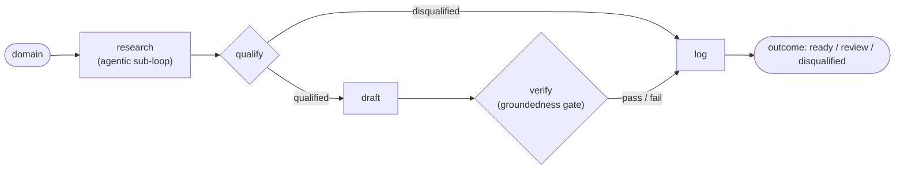

# pitch-pilot

**An autonomous SDR agent that turns a company domain into source-cited outreach —
every claim is first-party-sourced and faithfulness-judged before a human sees it,
so there's no hallucinated personalization.**

Give it a domain and pitch-pilot researches the company, qualifies it against your
Ideal Customer Profile, drafts outreach grounded only in cited facts, verifies every
claim against its source, and queues the result for human approval. **It never
auto-sends.**

_Last updated: 2026-06-14 · Full documentation: [`docs/`](docs/index.md)_

## Results

> `cerebras/gpt-oss-120b`, gate-critical calls at **temperature 0**, 2026-06-14. The
> qualifier fix ([ADR-0015](docs/decisions.md)) was developed on the original 17 and
> validated on a **held-out** set it never saw. Every number is from
> [`docs/evals.md`](docs/evals.md), the source of truth.

**Held-out validation — the headline (n=8 unseen companies):**

| Stage | Metric | Result |
| --- | --- | --- |
| **Qualification** (n=8) | Accuracy / Precision / Recall / **F1** | 1.0 / 1.0 / 1.0 / **1.0** |
| | Confusion — TP / FP / TN / FN | 4 / 0 / 4 / 0 |
| **Drafting** | Draft-gate pass-rate | 0.75 (3 of 4) |
| **Grounding** | Mean groundedness ¹ | 0.9583 |

All eight unseen companies landed correctly — three good-fit fintechs qualified, two
non-fintech tools and an incumbent bank disqualified, and both borderlines (coinbase,
shopify) went the labeled way.

**The fix's evidence — original 17, before → after** (same set, same temp-0 config,
only the qualifier changed):

| Metric (n=17) | Before | After |
| --- | --- | --- |
| **Qualification F1** | 0.769 | **0.947** |
| Precision / Recall | 0.625 / 1.0 | 1.0 / 0.9 |
| Confusion TP/FP/TN/FN | 10/6/1/0 | 9/0/7/1 |

The fix eliminated **all six** false positives (precision 0.625 → 1.0) via a
reliably-firing negative-signal veto plus a required-industry penalty. **Both sets
improved, so it generalizes rather than overfitting.** The cost, stated honestly: one
new false negative on the dev set — `ramp.com`, when the assessor flakily returned
`industry=unknown` for a real fintech (recall 1.0 → 0.9). The held-out set did not
show this. Full provenance, the live-re-verifiability caveat, and the draft-gate
overreach finding are in [Evaluation](docs/evals.md).

¹ Groundedness = faithful body-claims ÷ total body-claims; under the strict gate it
equals the faithfulness score (same numerator) — one signal, not two.

## Demo

Verbatim CLI output (trimmed only where marked `[...]`), same config as the tables
above: `cerebras/gpt-oss-120b`, eval ICP (`examples/eval_icp.json`), gate-critical
calls at temperature 0. Research is reused from cache; qualify/draft/verify run live.
Cerebras is not bit-deterministic even at temperature 0, so each demo is one fresh
sample.

_[Live demo: coming after deploy]_

**1. A qualified lead that clears the gate — `mercury.com`:**

```text
PS> python -m pitch_pilot.cli run mercury.com --icp examples/eval_icp.json

Running pipeline for mercury.com (provider = cerebras, icp = examples/eval_icp.json) ...

Research: 64 grounded facts from 17 sources (4 queries).

== Qualification ==
  QUALIFIED — fit score 0.83
  Fit score 0.83 >= threshold 0.50; industry=match, size=unknown, region=match; matched 2/4 positive signal(s).
  matched: processes online payments or transactions at scale, recently raised growth funding

== Draft ==
  Subject: Helping Mercury streamline global payments and cash management

  I noticed Mercury’s fintech platform offers free checking and savings accounts with zero minimums and up to 3.60% yield, which is a great foundation for growing businesses. Your payments product lets users send money worldwide with no fees on USD payments, and the instant issuance of cards gives teams immediate control over spend. Since Mercury helps manage business finances at every stage of growth, I think our integrated finance‑automation solution could further reduce manual effort and enhance your existing tools.

  Grounded hooks: Mercury offers free checking and savings accounts with zero minimums and up to 3.60% yield through Treasury by Mercury Advisory. | Mercury payments allow sending money worldwide with no fees on USD payments. | [...]

== Verification ==
  groundedness 1.00 (4/4 verified) · faithfulness 1.00 — PASS
  claims by source tier: own_site=5
    - tier=own_site substring_ok=yes faithfulness=faithful
      claim: Mercury’s fintech platform offers free checking and savings accounts with zero minimums and up to 3.60% yield
      source: https://mercury.com
    - tier=own_site substring_ok=yes faithfulness=faithful
      claim: Mercury’s payments product lets users send money worldwide with no fees on USD payments
      source: https://mercury.com
    [... 2 more faithful own_site claims ...]

== Logged ==
  outcome: ready
  written to: pitch_pilot_store.jsonl
  (pitch-pilot never auto-sends — a human approves before anything goes out.)
```

**2. The groundedness gate rejecting a bad claim — `wise.com`:**

Wise qualifies cleanly, but its draft turned the fact "In Q4, 65% of transfers **were**
instant" into "65% of transfers **now** complete in under 20 seconds" — dropping the
"Q4" qualifier and present-tensing a past-quarter stat. The judge rated that claim
`overreach`, the draft **failed**, and the lead was routed to human review instead of
`ready` — the gate catching exactly the kind of subtle over-claim it is built for.

```text
PS> python -m pitch_pilot.cli run wise.com --icp examples/eval_icp.json

Running pipeline for wise.com (provider = cerebras, icp = examples/eval_icp.json) ...

Research: 65 grounded facts from 17 sources (4 queries).

== Qualification ==
  QUALIFIED — fit score 0.83
  Fit score 0.83 >= threshold 0.50; industry=match, size=unknown, region=match; matched 2/4 positive signal(s).
  matched: processes online payments or transactions at scale, regulatory or compliance exposure

== Draft ==
  Subject: Supporting Wise’s fast, low‑cost international payments

  I’ve been impressed by Wise’s personal international account that lets users send, spend and convert money as if they were local. The claim that customers can save up to 45% on global transfers really stands out. I also saw that 65% of transfers now complete in under 20 seconds, showing how fast your service is. I’d love to explore how we could support that momentum.

  Grounded hooks: Wise offers a personal international account for sending, spending and converting money like a local. | Wise claims users can save up to 45% when sending money globally. | [...]

== Verification ==
  groundedness 0.67 (2/3 verified) · faithfulness 0.67 — FAIL
  claims by source tier: own_site=3
    - tier=own_site substring_ok=yes faithfulness=faithful
      claim: Wise has a personal international account that lets users send, spend and convert money as if they were local.
      source: https://wise.com
    - tier=own_site substring_ok=yes faithfulness=faithful
      claim: Customers can save up to 45% on global transfers.
      source: https://wise.com
    - tier=own_site substring_ok=yes faithfulness=overreach
      claim: 65% of transfers now complete in under 20 seconds.
      source: https://wise.com/gb/blog/q4-2024-mission-update-speed
  failures:
    ❌ overreach: 65% of transfers now complete in under 20 seconds.

== Logged ==
  outcome: review
  written to: pitch_pilot_store.review.jsonl
  (pitch-pilot never auto-sends — a human approves before anything goes out.)
```

## What it does

A deterministic five-step loop over a single domain:

`research → qualify → draft → verify → log`

**Research** runs an agentic, RAG-style retrieval sub-loop (the LLM plans queries →
search → fetch → extract cited facts). **Qualify** scores the company against a
declarative ICP. **Draft** writes outreach grounded only in first-party facts.
**Verify** audits that draft against its sources. **Log** files the lead for a human
as `ready`, `review` (needs edits), or `disqualified` — never sending anything.

## The differentiator — groundedness

Most "AI SDR" tools generate fluent outreach that is confidently wrong: invented
funding rounds, misattributed quotes, hallucinated headcounts. pitch-pilot makes
that structurally hard, in four layers:

1. **Extraction-time grounding.** The atomic unit of research is a typed `Fact` that
   *cannot be constructed without an `http(s)` source URL*, and the extractor keeps
   only claims whose verbatim evidence is a literal substring of the fetched page.
   An ungrounded fact is unrepresentable — not caught after the fact, but impossible.
2. **Source tiering.** Every fact is tagged `own_site` / `authoritative` /
   `third_party_snippet` by how durable and trustworthy its source is.
3. **First-party-only drafting.** Outreach may be grounded *only* in `own_site` /
   `authoritative` facts. The model selects which facts to stand on **by id**, so the
   hooks are grounded by construction — it can paraphrase freely, but it cannot
   fabricate.
4. **LLM faithfulness judge.** A judge reads the drafted body against the selected
   facts and rates every claim `faithful` / `overreach` / `unsupported`. A draft
   passes only if nothing is unsupported (and nothing overreaches, under strict mode).

The payoff is outreach you can audit sentence by sentence. Deep dive:
[Groundedness methodology](docs/groundedness.md).

## Architecture



**Hybrid by design:** a *deterministic outer graph* runs the fixed business steps in
a known, auditable order, while an *agentic sub-loop* runs inside the research step —
where open-ended exploration actually helps. (See [ADR-0003](docs/decisions.md).)

**Stack:** Python 3.11+ · **LangGraph** (outer graph) · **pydantic v2** (typed
contracts) · pluggable LLMs — **Cerebras / Groq / Gemini** (swappable behind one
interface) · Tavily search · httpx + selectolax fetch. Runs entirely on free tiers
(**$0**). More in [Architecture](docs/architecture.md) and [Pipeline](docs/pipeline.md).

## Limitations

Deliberate scope, stated plainly:

- **Small samples.** Held-out n=8, development n=17, human-proposed labels, a single
  run each. F1 1.0 on eight companies is encouraging, not conclusive — a larger
  held-out set is the next step before the headline is bankable.
- **One residual qualification miss + run-to-run variance.** Making `industry=unknown`
  count against a company (the fix) costs recall when the assessor *flakily* fails to
  confirm a real fintech's industry — it cost one false negative (`ramp.com`) on the
  dev set. More broadly, Cerebras is not bit-deterministic even at temperature 0, so a
  company's draft/verdict can vary between runs; these are single runs, not averages.
- **Draft-gate overreach (noted, not fixed this pass).** The gate rejects a real share
  of *qualified* drafts (≈44% pre-fix, ≈22–25% after) — the **drafter** over-claims
  beyond the cited facts and the gate correctly catches it. Tightening the draft prompt
  is the next step ([details](docs/evals.md)).
- **Human-in-the-loop.** It never auto-sends; every lead lands in a review queue.
- **No LinkedIn scraping** — out of scope by design.
- **Lead discovery is future work** — today you supply the domain.

## Quickstart (Windows / PowerShell)

```powershell
py -3.11 -m venv .venv
.\.venv\Scripts\Activate.ps1
pip install -e ".[dev]"
Copy-Item .env.example .env      # then add GEMINI_API_KEY + TAVILY_API_KEY (other keys optional)
python -m pitch_pilot.cli smoke  # verifies search + LLM + fetch with your keys
python -m pitch_pilot.cli run ramp.com --icp examples/eval_icp.json
```

Unit tests are fully mocked — **no keys, no network**: `pytest`. Full setup and the
Windows `.env` gotcha: [Getting Started](docs/getting-started.md).

## Documentation

- **[Full docs site](docs/index.md)** — narrative guides + an API reference
  auto-generated from docstrings (`mkdocs serve`).
- **[Groundedness methodology](docs/groundedness.md)** — the hero guarantee in depth.
- **[Evaluation](docs/evals.md)** — dataset, labeling rubric, metrics, and the numbers above.
- **[Design decisions (ADRs)](docs/decisions.md)** — why it is built this way.

## License

MIT
