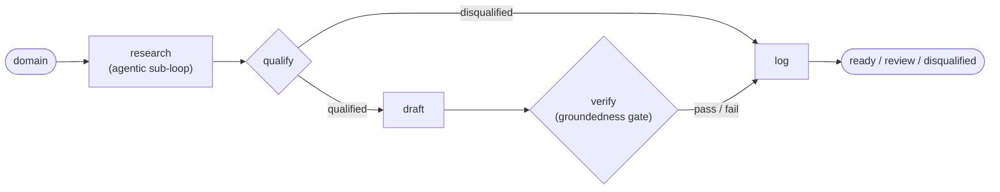

# pitch-pilot

An autonomous SDR agent that turns a company domain into source-cited cold outreach. Every
claim it writes is backed by a first-party `Fact`, judged for faithfulness against that
source, and queued for a human before anything goes out. It never auto-sends.

_Last updated: 2026-06-18 · Full documentation: [`docs/`](docs/index.md)_

## The problem

Most "AI SDR" tools generate fluent outreach that is confidently wrong: invented funding
rounds, misattributed quotes, headcounts that don't exist. The personalization reads well
and can't be trusted. pitch-pilot's goal is the inverse — outreach you can audit sentence by
sentence. Give it a domain and it runs a fixed five-step loop:

`research → qualify → draft → verify → log`

It researches the company from the open web, qualifies it against an Ideal Customer Profile
(ICP), drafts outreach grounded only in cited facts, verifies every claim against its source,
and files the lead for human approval as `ready`, `review`, or `disqualified`. LinkedIn
scraping is out of scope, and lead discovery is future work — today you supply the domain.

## How it works

### Groundedness is enforced at the type boundary

The distinctive decision is *where* grounding lives. The atomic unit of research is a `Fact`,
and a `Fact` cannot be constructed without an `http(s)` `source_url` — a pydantic validator
rejects an empty or non-HTTP URL at construction time
([`models/fact.py`](src/pitch_pilot/models/fact.py)). An ungrounded fact is not flagged after
the fact; it is unrepresentable. Four layers build on that base:

1. **Construction-time grounding** — `Fact` refuses to exist without a source URL (above).
2. **Extraction-time evidence check** — the research extractor (`extract_facts`) keeps only
   claims whose verbatim `evidence` snippet is a literal substring of the fetched page text,
   dropping anything the model pulled from its own prior knowledge.
3. **First-party-only drafting** — only `own_site` / `authoritative` facts are offered to the
   drafter as *claimable*. It writes the email as free prose and returns the **ids** of the
   facts it grounded each claim in, so `Draft.hooks_used` resolves to real first-party facts
   by construction. It can paraphrase freely; it cannot fabricate.
4. **Faithfulness judge** — `judge_body` reads the drafted body against the selected facts and
   rates each claim `faithful` / `overreach` / `unsupported`. The draft passes only if nothing
   is `unsupported` — and, under the default strict mode, nothing `overreach`es. It fails
   closed: any judge error counts as a failure.

Every fact also carries a **source tier** — `own_site`, `authoritative`, or
`third_party_snippet` — assigned by `classify_source_tier` purely from the URL (deterministic,
no model call). Only the first two tiers may carry a stated claim; search-snippet facts can
inform tone but never become a hook. The full methodology is in
[Groundedness](docs/groundedness.md).

### Hybrid architecture: deterministic graph, agentic research



A **deterministic outer graph** (LangGraph, over a typed `PipelineState`) runs the fixed
business steps in a known, auditable order, with two conditional gates: a disqualified company
skips drafting and goes straight to `log`; after `verify`, the `log` node routes the lead by
the verdict — a passing draft is `ready`, a failing one goes to `review`. Nothing is sent
automatically.

Inside the `research` step lives an **agentic sub-loop**, where open-ended exploration
actually helps. The next search query is chosen by the LLM planner, not read from a fixed
list:

`seed-fetch the company site → extract facts → planner picks the next query (or stops) →
search → extract → … `

until the planner is satisfied or the `RESEARCH_MAX_QUERIES` budget is hit (a hard cap that
always overrides the planner). Bad pages and empty searches are recorded as non-fatal errors
and the loop moves on — research never crashes the run. See
[Architecture](docs/architecture.md) and [Pipeline](docs/pipeline.md).

### Swappable clients

The pipeline depends on small interfaces, not vendors. `LLMClient` has two operations
(`complete`, `complete_json`) and three implementations — **Gemini** (default), **Groq**, and
**Cerebras** — selected at runtime by `LLM_PROVIDER`. Search is a `SearchClient` (Tavily) and
fetching is `fetch_page` (httpx + selectolax). Vendor SDKs are imported lazily, so importing a
client never requires its package, and the unit tests run with no provider installed and no
network.

## Results

> `cerebras/gpt-oss-120b`, gate-critical calls (qualify / draft / verify-judge) at temperature
> 0, 2026-06-14. Labels are human-proposed against the rubric in [`docs/evals.md`](docs/evals.md),
> which is the source of truth for every number here. The qualifier fix
> ([ADR-0015](docs/decisions.md)) was developed on the development set and validated on a
> held-out set it never saw.

Qualification, measured on a labeled fintech eval set:

| Metric | Development set (n=17) | Held-out set (n=8) |
| --- | --- | --- |
| F1 | 0.947 | 1.0 |
| Precision / Recall | 1.0 / 0.90 | 1.0 / 1.0 |
| Confusion (TP/FP/TN/FN) | 9 / 0 / 7 / 1 | 4 / 0 / 4 / 0 |
| Draft-gate pass-rate | 7/9 = 0.78 | 3/4 = 0.75 |
| Mean groundedness | 0.95 | 0.958 |

The qualifier fix eliminated every false positive on the development set (precision 0.625 →
1.0) and generalized cleanly to the eight unseen companies. These are small samples on single
runs — F1 1.0 on eight companies is encouraging, not conclusive. Full provenance, the
before/after breakdown, and the live re-verifiability caveat are in [Evaluation](docs/evals.md).

## Demo: the gate rejecting an over-claim

Mercury qualifies and four of its draft's claims check out, but the draft fuses two real
capabilities ("AI-driven tools" and "instant card issuance") into a benefit the cited facts
never state — that together they "reduce time spent on money management." The judge rates that
claim `overreach`, the draft **fails**, and the lead is routed to human `review` instead of
`ready`. Trimmed, verbatim CLI output (research reused from the eval cache; qualify/draft/verify
run live):

```text
PS> python -m pitch_pilot.cli run mercury.com --icp examples/eval_icp.json

== Verification ==
  groundedness 0.80 (4/5 verified) · faithfulness 0.80 — FAIL
  claims by source tier: own_site=5
    - tier=own_site substring_ok=yes faithfulness=faithful
      claim: Mercury provides free checking and savings accounts with zero minimums and competitive yields
      source: https://mercury.com
    [... 3 more faithful own_site claims ...]
    - tier=own_site substring_ok=yes faithfulness=overreach
      claim: Mercury's AI-driven tools and instant card issuance reduce time spent on money management
      source: https://mercury.com/releases
  failures:
    ❌ overreach: Mercury's AI-driven tools and instant card issuance reduce time spent on money management

== Logged ==
  outcome: review
  written to: pitch_pilot_store.review.jsonl
  (pitch-pilot never auto-sends — a human approves before anything goes out.)
```

## Setup

Python 3.11+ on any OS; Windows / PowerShell is a first-class dev environment.

```powershell
py -3.11 -m venv .venv
.\.venv\Scripts\Activate.ps1
pip install -e ".[dev]"
Copy-Item .env.example .env      # then add GEMINI_API_KEY + TAVILY_API_KEY (other keys optional)
```

Two keys are required — `GEMINI_API_KEY` and `TAVILY_API_KEY`; `GROQ_API_KEY` /
`CEREBRAS_API_KEY` are only needed if you select that provider via `LLM_PROVIDER`. On Windows,
create `.env` with `Copy-Item` (not `Set-Content -Encoding utf8`, which writes a BOM that
corrupts the first key). All settings are documented in [Configuration](docs/configuration.md).

## Usage

The CLI has three commands (also exposed as the `pitch-pilot` console script):

```powershell
# 1. Verify your keys: one Tavily search, one LLM completion, one page fetch.
python -m pitch_pilot.cli smoke

# 2. Run just the agentic research loop and print grounded facts grouped by category.
python -m pitch_pilot.cli research checkout.com

# 3. Run the full pipeline against an ICP; prints the verdict, draft, per-claim
#    verification, and where the lead was logged.
python -m pitch_pilot.cli run checkout.com --icp examples/eval_icp.json
```

`run` writes the lead as JSON Lines via `JsonStore`: `ready` / `disqualified` leads append to
`pitch_pilot_store.jsonl`, and anything needing edits is enqueued to
`pitch_pilot_store.review.jsonl`. `--icp` defaults to `examples/icp.sample.json`. The offline
evaluation harness lives in [`evals/`](docs/evals.md) (`python -m evals.run_eval`).

## Tests

```powershell
pytest
```

**149 tests, all passing, no network** (~2s). External clients are mocked, so the suite needs
no API keys. Coverage spans the data contracts and the `Fact` grounding validator, fail-loud
config loading, LLM JSON parsing / provider selection / vendor-error normalization, the
research extractor's evidence-substring check and source tiering, qualifier scoring and the
negative-signal veto, Policy-B claim-pool gating and fact-selection in drafting, the
faithfulness gate with its scores and tier breakdown, the end-to-end pipeline routing on
mocked clients, and the eval metrics.

## Tech stack

- **Python 3.11+**, `src/` layout, installable via `pip install -e ".[dev]"`.
- **pydantic v2** + **pydantic-settings** — typed data contracts and fail-loud config.
- **LangGraph** (1.x) — the deterministic outer `StateGraph`.
- **LLMs:** `google-genai` (Gemini), `groq`, `cerebras-cloud-sdk` — swappable behind one
  interface. Default models run on free tiers.
- **Tavily** (`tavily-python`) — web search.
- **httpx** + **selectolax** — fetch and HTML-to-text extraction.
- **pytest** + **pytest-mock** — the unit suite. **MkDocs Material** + **mkdocstrings** — the
  docs site, with the API reference generated from docstrings.

## Status

Phases P0–P4 are implemented: the typed scaffold, the agentic research node, the full
deterministic pipeline, the verification gate, and the offline eval harness (the project is at
`0.9.0`; see the [Changelog](CHANGELOG.md) and [Roadmap](docs/roadmap.md)). `JsonStore` is a
local file-backed store; production `Store` backends and a human-review UI over the queue (P5)
are not built — `app/` is a placeholder. The eval numbers above are from small, single-run
samples; treat them as directional. Honest scope and known limitations are tracked in
[Limitations](docs/limitations.md).

## Documentation

- **[Full docs site](docs/index.md)** — narrative guides plus an API reference auto-generated
  from docstrings (`mkdocs serve`).
- **[Groundedness](docs/groundedness.md)** — the four-layer guarantee in depth.
- **[Evaluation](docs/evals.md)** — dataset, labeling rubric, metrics, and the numbers above.
- **[Design decisions (ADRs)](docs/decisions.md)** — why it is built this way.

## License

MIT
